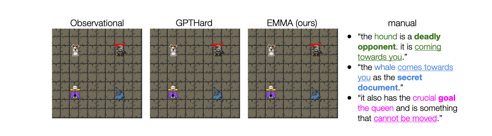

# Language-Guided World Models: A Model-Based Approach to AI Control
This repository contains the code for running experiments. We propose *Language-Guided World Models* (LWMs), which can capture environment dynamics by reading language descriptions. There are two main phases of LWM learning, one being learning the language-guided world model by exploring the environment, and the other being model-based policy learning through imitation learning / behavior cloning.

Visit [the project's website](https://language-guided-world-model.github.io/) to learn more.



## 🛠️ Getting Started: Setup

Create a conda environment

```
conda create -n lwm python=3.9 && conda activate lwm
```

Install the relevant dependencies through pip:

```
pip install -r requirements.txt
```

### Trajectory Dataset Link
Finally, download the trajectory dataset from [this link](https://drive.google.com/file/d/1vUwP4EzBMrmDZWhmnXFie2woWbGzjKUq/view?usp=sharing), unzip the file (~7 GB), and put the .pickle file inside `world_model/custom_dataset`

### Pre-trained Checkpoints
Read the following sections for different steps of the training process (train WM, then train policy). We provide some checkpoints for both the trained world model, as well as the expert EMMA policy that you can use to skip world model training.
These were the some of the checkpoints used in the experiments described in the paper. Download the checkpoints [at this link](https://drive.google.com/file/d/1YiQyjeInXqztyffAbZ-8SDsnS2II8HUh/view?usp=sharing) and place them in an appropriate folder.

## 🌎 Training the World Model

First change directory into world_model/
```
cd world_model
```

In this setting, the world model will learn from observing trajectories and the provided natural language from the game manuals. To train the world model, use the following bash script
```
bash scripts/train_wm.sh ${MODEL_NAME}
```
where `${MODEL_NAME}` is one of
* `none` (observational, doesn't use language)
* `standardv2` (standard Transformer)
* `direct` (GPT-hard attention)
* `emma` (our proposed EMMA-LWM model)
* `oracle` (oracle semantic-parsing).

The above script will generate a folder in `experiments/` containing model checkpoints. For more details on the different models, see the paper. The seed is fixed here and can be changed in the script. Full results are in Table 1 of the paper.

To interact with a trained world model, run:
```
bash scripts/play_wm.sh ${MODEL_NAME}
```

You can change the `game_id` in `play_wm.py` to visualize a different game. If you define a different seed for training the world model, make sure to define the same seed when playing (hard-coded in the current setup).

## 🤖 Downstream Policy Learning

**Note:** *For filtered behavior cloning, it requires the use of an expert policy. See paper for more details. *

Make sure you are in the `world_model/` directory. First, train an expert policy and save its checkpoints (do not skip this step!):

```
bash scripts/train_emma_policy.sh
```

Once you have learned a language-guided world model following "[Training the World Model](#training-the-world-model)", you can apply it to downstream policy learning on Messenger (see Table 3 for comprehensive results).
```
bash scripts/train_downstream.sh ${TRAIN_TASK} ${MODEL_NAME} ${SPLIT} ${GAME}
```
where
* `${TRAIN_TASK}` is one of `imitation` (Imitation Learning) or `filtered_bc` (Filtered Behavior cloning). See paper for more details.
* `${MODEL_NAME}` is one of the world models listed in the [Training the World Model](#training-the-world-model) section that has been trained.
* `${SPLIT}` is the difficulty to evaluate on, and is one of `easy` (NewCombo), `medium` (NewAttr), `hard`(NewAll). See paper for more details.
* `${GAME}` is the game id on MESSENGER to evaluate on. It ranges from 0-29.
* `${ORACLE_CKPT}` is either `half`, which will set the oracle weights to a training checkpoint where it was roughly halfway trained. This is specifically for half-trained filtered behavior cloning (see paper for more details). In our experiments, this correponded to `policy_2000.ckpt`, but you can manually change this in the script. Otherwise, any other string will set it to the best oracle world model checkpoint on the hardest validation split.

The above script will generate a folder in `experiments/` containing model checkpoints.


## Credits

* https://github.com/eloialonso/iris
* https://github.com/karpathy/minGPT

## Citation

```
@article{zhang2024languageguided
  title={Language-Guided World Models: A Model-Based Approach to AI Control},
  author={Zhang, Alex and Nguyen, Khanh and Tuyls, Jens and Lin, Albert and Narasimhan, Karthik},
  year={2024},
  journal={arXiv},
}
```
